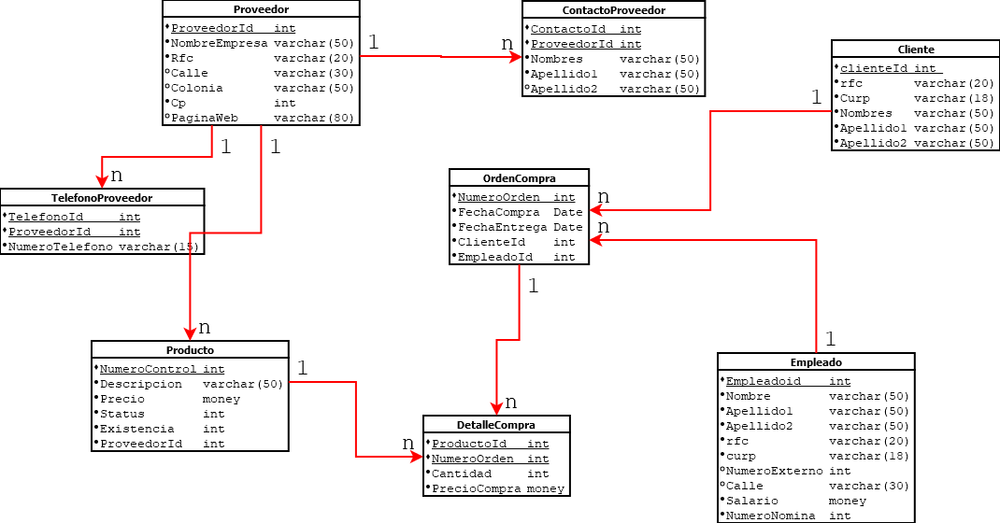

# Requerimientos

Una empresa encargada de las ventas de diferentes productos desea crear una base de datos que controles los proveedores, clientes, empleados, categorías de producto y órdenes de compra. Para los proveedores se necesita almacenar un numero de control, nombre de la empresa, dirección (numero, calle, colonia, estado), cp,teléfono, página web, teléfono de contacto o contactos del proveedor, nombre del contacto, email del contacto.  Para los empleados se desea almacenar un numero de nómina, nombre completo del empleado, rfc, curp, salario (El salario máximo es de 65000), para las ordenes de compra  se necesita almacenar la fecha de creación de la orden, el empleado que la realizo, al cliente que se le vende, la fecha de entrega y los diferentes productos que contiene.  El producto debe almacenar un numero de control y una descripción única, status, existencia y un precio. La categoría debe tener un identificador y nombre único de categoría.  La compra siempre debe tener un precio de venta que se obtiene del precio unitario del producto y una cantidad vendida.

# Diagrama Conceptual E-R

# Diagrama Lógico Relacional

# Diagrama Fisico con SQL-LDD

# Llenado de BD con SQL-LMD

# Consultas Simples